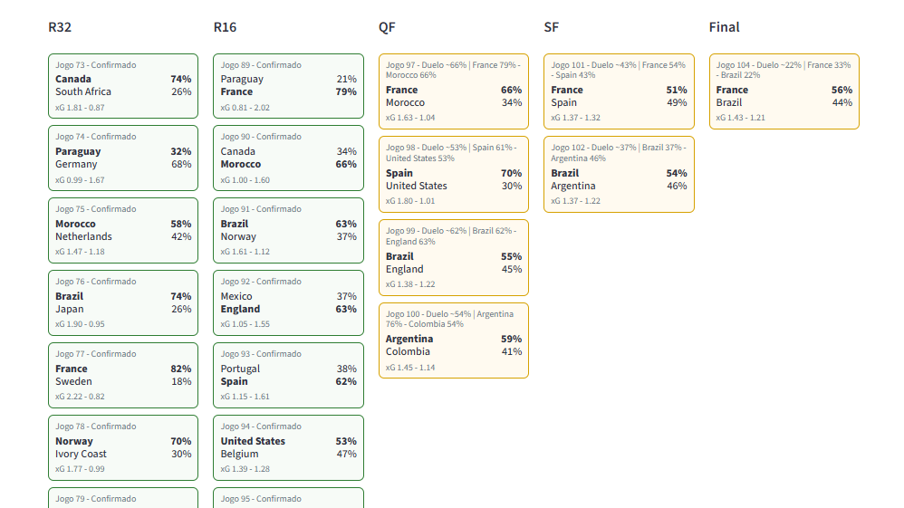
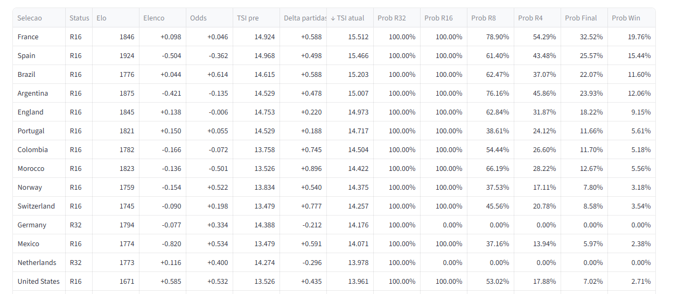
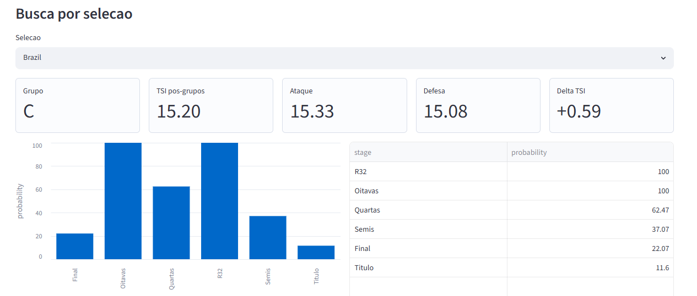
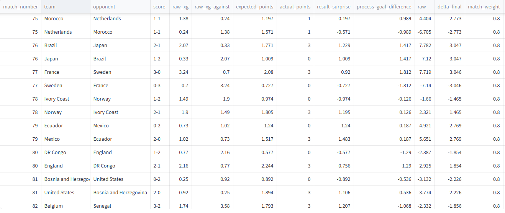

# World Cup Oracle

> A probabilistic decision-support system for tournament forecasting, combining rating models, uncertainty simulation, validation metrics and dashboard-ready outputs.

World Cup Oracle is a local analytics project for forecasting the 2026 World Cup. It turns match history, squad strength, market priors and live tournament evidence into expected goals, advancement probabilities, title odds and model-audit artifacts.

This is not a single "who wins?" predictor. It is a decision-support system: every output is designed to be explainable, recalculated after new evidence, and validated against completed matches.



## Problem

Tournament forecasting has three hard parts:

- team strength is latent and changes over time;
- knockout paths are conditional, not fixed until results arrive;
- probability quality matters more than picking one champion.

Most public predictions collapse this into a ranking or a single simulated bracket. World Cup Oracle keeps the uncertainty visible: match odds, expected goals, bracket paths, stage probabilities, model deltas and validation metrics are all separate outputs.

## Current Snapshot

Updated through the end of the quarter-finals on 2026-07-12.

```text
Operational completed matches: 100
Group-stage validation matches: 72
Knockout matches audited: 28
Current live teams: 4
```

Current semi-finals:

```text
France vs Spain
Argentina vs England
```

Current title probabilities:

```text
Spain:     30.1%
France:    28.1%
Argentina: 24.2%
England:   17.6%
```

## Data

The project uses a local analytical data stack: CSV/JSON raw inputs, normalized Parquet tables and dashboard-ready processed outputs.

Core inputs:

- international cycle matches for the custom Elo base;
- FIFA points used only to initialize Elo;
- World Cup groups, schedule and knockout template;
- official Annex C mapping for best third-place teams;
- squad data by player, sector, age and market value;
- long-term winner odds as a capped prior;
- FotMob match details for goals, xG and process stats during the tournament.

Operational outputs live in `data/processed/`, including:

```text
team_current_strength.parquet
attack_defense_current.parquet
match_probabilities_post_groups.parquet
team_stage_probabilities.parquet
knockout_match_probabilities.parquet
knockout_match_performance.parquet
knockout_match_performance_audit.parquet
validation_summary.parquet
validation_calibration_bins.parquet
```

## Method

The pipeline is intentionally modular and local:

```text
raw data / API cache
-> normalized Parquet
-> custom cycle Elo
-> TSI, the Team Strength Index
-> squad and market adjustments
-> attack / defense split
-> expected-goals model
-> Poisson match probabilities
-> Monte Carlo tournament simulation
-> validation and audit reports
-> Streamlit dashboard
```

The central strength metric is `TSI`, a 0-20 rating composed from:

```text
FIFA-initialized Elo
+ custom cycle Elo movement
+ schedule adjustment
+ squad adjustment
+ capped long-term odds adjustment
+ completed-match performance deltas
```

Expected goals use a saturated sublinear TSI gap, which makes small strength edges matter without letting extreme mismatches produce unrealistic xG:

```text
d = TSI_A - TSI_B
V(d) = sign(d) * min(V_max, a * |d|^p)

lambda_A = base_goals * exp(k * ( V(d) + profile_signal))
lambda_B = base_goals * exp(k * (-V(d) + profile_signal))
```

Current calibrated values:

```text
base_goals = 1.30
k = 0.20
a = 1.25
p = 0.70
V_max = 3.50
```

Completed World Cup matches update `TSI_current` through a performance model that combines result surprise and process surprise:

```text
raw_delta = 4.0 * process_surprise + 3.0 * result_surprise
```

The raw delta is soft-capped, zero-sum within each match, and then applied conservatively to current TSI. Penalty shootouts decide advancement, but they are kept out of modeled goals.

## Decision Science Angle

The project is built around decision quality, not narrative certainty.

It supports questions like:

- Which team is strongest right now, after observed tournament evidence?
- Which upcoming match has the largest upset risk?
- How much did a result change the model's belief?
- Which path is most likely, and which path is merely possible?
- Is the model calibrated, or is it overconfident?
- What changes when a key assumption, cap or curve is recalibrated?

The outputs are designed for decision workflows: transparent assumptions, repeatable runs, explicit uncertainty, validation metrics and auditable deltas.

## Validation And Model Performance

The current validation layer evaluates completed group-stage match probabilities with Brier Score, Log Loss, calibration bins and score likelihood. Knockout matches are audited separately through zero-sum performance deltas because their advancement logic includes extra time and penalties.

Latest report:

```text
docs/reports/validation-2026-07-12.md
```

Current metrics:

```text
Validation matches: 72
Brier Score: 0.5097
Log Loss: 0.8749
Expected Calibration Error: 0.1423
Score negative log-likelihood: 2.8853
```

A short model-performance brief is available at:

```text
docs/reports/model-performance-summary.md
```

## Results

The MVP can produce:

- expected goals for each matchup;
- 90-minute win/draw/loss probabilities;
- advancement probability including extra time and penalties;
- likely knockout bracket and conditional matchups;
- stage probabilities for every team;
- current TSI after completed matches;
- match-level performance deltas;
- validation reports and calibration artifacts.



## Decisions Supported

World Cup Oracle can support concrete analytical decisions:

- rank the strongest remaining teams after new match evidence;
- compare model probability against market odds;
- identify overvalued or undervalued teams;
- explain why a team gained or lost strength after a match;
- estimate expected goals before a knockout game;
- prioritize which model assumptions deserve recalibration;
- generate clean outputs for reports, dashboards or downstream analysis.

## Tradeoffs

The project is deliberately scoped as an analytical MVP.

Chosen tradeoffs:

- local Parquet over a database to keep iteration fast and reproducible;
- Poisson over heavier score models for interpretability;
- capped odds and squad adjustments to avoid overfitting priors;
- soft-capped match deltas so one game cannot rewrite the model;
- manual contextual flags for rotation/guaranteed position instead of fragile inference;
- API cache-first updates to avoid unnecessary calls and preserve reproducibility.

Not currently included:

- Spark, PostgreSQL, FastAPI or React;
- automated scraping of every squad/odds source;
- Dixon-Coles score correction as default;
- live betting-grade latency.

## What This Project Proves

This project demonstrates the ability to:

- design an end-to-end probabilistic forecasting system;
- model uncertainty rather than only rankings;
- combine statistical modeling with product-ready data outputs;
- build reproducible local data pipelines with Polars and Parquet;
- separate priors, observations, calibration and presentation;
- create validation loops for probabilistic predictions;
- communicate model behavior to both technical and non-technical users;
- make pragmatic engineering tradeoffs without overbuilding infrastructure.

## Screenshots

Dashboard home:


Team view:



Model audit:



## Architecture

```text
src/world_cup_oracle/
  config/              parameters and constants
  data/                schemas and Parquet IO
  elo/                 custom cycle Elo
  tsi/                 Team Strength Index components
  squad/               squad adjustment logic
  odds/                long-term odds adjustment
  attack_defense/      TSI split and expected goals
  simulation/          Poisson and tournament simulation
  validation/          scoring metrics
  pipeline/            end-to-end data workflows
app/                   Streamlit dashboard
pipeline outputs/      data/interim and data/processed
reports/               docs/reports
```

## Setup

Python 3.11+ is recommended.

macOS/Linux:

```bash
python -m venv .venv
source .venv/bin/activate
python -m pip install --upgrade pip
pip install -e ".[dev,app]"
```

Windows PowerShell:

```powershell
python -m venv .venv
.\.venv\Scripts\Activate.ps1
python -m pip install --upgrade pip
pip install -e ".[dev,app]"
```

## Run

Dashboard:

```bash
streamlit run app/streamlit_app.py
```

Update from local/cache data:

```bash
python -m world_cup_oracle.pipeline.update_after_matches
```

Fetch new FotMob details and recalculate:

```bash
python -m world_cup_oracle.pipeline.update_after_matches --fetch-fotmob
```

Validation report:

```bash
python -m world_cup_oracle.pipeline.validation_report
```

## Tests And Quality

```bash
ruff check app src tests
pytest
```

Recent targeted checks used during the quarter-final update:

```text
ruff check app src tests -> passed
pytest tests/test_tournament_projection.py tests/test_match_performance_pipeline.py -q -> 11 passed
```

## Repository Scope

The repository intentionally keeps the MVP local and analytical. The important artifact is not only the Streamlit app, but the full decision pipeline: assumptions, raw/cache data, normalized Parquet, model outputs, validation reports and UI surfaces that make the probabilities usable.
