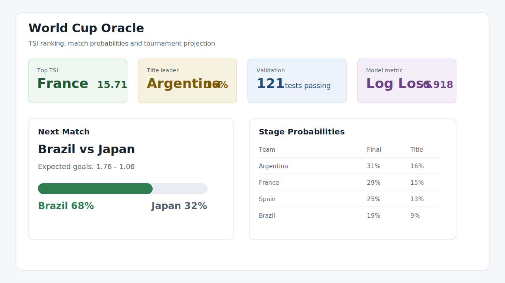
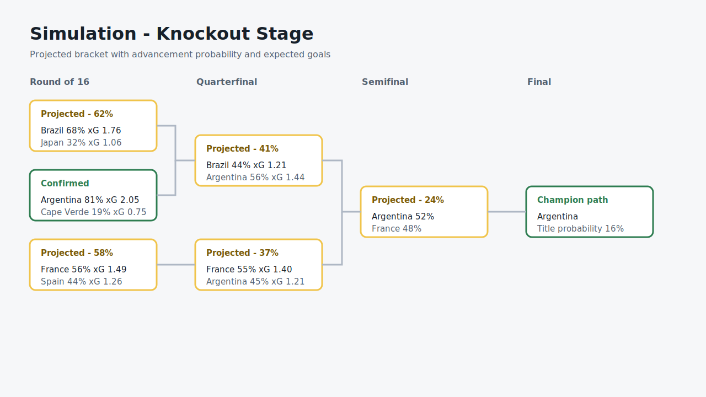

# World Cup Oracle

World Cup Oracle is a local analytics system for the 2026 World Cup. It estimates team
strength, match probabilities, expected goals, bracket paths and title odds from a
reproducible Python + Parquet pipeline.

The project is intentionally not a web-service architecture. It is a compact analytical
MVP built for transparent modeling, fast iteration and explainable outputs.



## Why This Matters

World Cup predictions are usually presented as a single ranking or a single simulated
winner. That hides the most important part: uncertainty.

This project treats the tournament as a distribution of possible futures. A strong team can
still lose. A weaker team can still have a real path. The useful question is not only "who
wins?", but:

- how strong is each team right now;
- where does that strength come from;
- how much does matchup shape the result;
- what does the most likely bracket look like;
- which probabilities are well calibrated;
- when should the model update after new evidence.

## What It Does

- Builds a custom cycle Elo from FIFA points and international results.
- Maps adjusted Elo into TSI, the Team Strength Index.
- Adds capped schedule, squad and long-term market adjustments.
- Splits TSI into attack and defense through a style profile.
- Converts team strength into expected goals by matchup.
- Uses Poisson for 90-minute score probabilities.
- Simulates groups, best third-place teams, extra time, penalties and knockouts.
- Updates TSI after completed World Cup matches.
- Validates predictions with Brier Score, Log Loss, calibration bins and score likelihood.
- Exports dashboard-ready Parquet tables.

## Example Decision

One modeling question was how much a small TSI edge should matter in knockouts.

Using a plain exponential gap made large mismatches produce too much xG. Using a weak gap
made elite matchups look too close. The current compromise applies a limited sublinear
transformation:

```text
d = TSI_A - TSI_B
V(d) = sign(d) * min(3.50, 1.25 * |d|^0.70)

lambda_A = 1.30 * exp(0.20 * ( V(d) + profile_signal))
lambda_B = 1.30 * exp(0.20 * (-V(d) + profile_signal))
```

That lets balanced games move from 51/49 toward a more useful 55/45 when one side is
slightly stronger, while preventing extreme mismatches from exploding into unrealistic xG.

## Current Output Shape

The pipeline writes the core analytical layer to `data/processed/`:

```text
ratings_elo.parquet
tsi_pre_cup.parquet
attack_defense_post_groups.parquet
match_probabilities.parquet
match_probabilities_post_groups.parquet
team_stage_probabilities.parquet
knockout_match_probabilities.parquet
match_performance_audit.parquet
validation_summary.parquet
```

The dashboard reads those files directly. No database or backend server is required.



## Final Result

The MVP can answer questions like:

- "What is Brazil vs Japan in expected goals and advancement probability?"
- "Who is most likely to reach the semifinal?"
- "Which projected knockout card is confirmed and which is still conditional?"
- "How much did a completed match change a team's current TSI?"
- "Is the model calibrated against completed games?"

The latest validation pipeline reports completed-match metrics into:

```text
docs/reports/validation-YYYY-MM-DD.md
data/processed/validation_summary.parquet
data/processed/validation_calibration_bins.parquet
```

## Architecture

```text
raw data / API cache
-> normalized Parquet
-> Elo and TSI
-> squad and odds adjustments
-> attack / defense
-> expected goals
-> Poisson match model
-> Monte Carlo tournament simulation
-> validation report
-> Streamlit dashboard
```

Stack:

```text
Python
Polars
Parquet
NumPy / SciPy
Streamlit
pytest
ruff
Markdown
```

This MVP intentionally does not use Spark, PostgreSQL, FastAPI or React.

## Setup

```bash
python -m venv .venv
source .venv/bin/activate
pip install -e ".[dev,app]"
```

On Windows PowerShell:

```powershell
python -m venv .venv
.\.venv\Scripts\Activate.ps1
pip install -e ".[dev,app]"
```

## Run The Dashboard

```bash
streamlit run app/streamlit_app.py
```

## Update After New Matches

Use local/cache data only:

```bash
python -m world_cup_oracle.pipeline.update_after_matches
```

Fetch new FotMob details and then recalculate:

```bash
python -m world_cup_oracle.pipeline.update_after_matches --fetch-fotmob
```

## Validation

```bash
python -m world_cup_oracle.pipeline.validation_report
```

The odds comparison activates when this file exists:

```text
data/interim/odds_match_by_match.parquet
```

## Mock Pipeline

The repository still ships a tiny mock pipeline for smoke tests and onboarding:

```bash
world-cup-oracle-mocks
world-cup-oracle-normalize-mocks
world-cup-oracle-validate-annex-c data/interim/worldcup_annex_c.parquet
world-cup-oracle-build-mock-outputs
```

The full official Annex C table has 495 combinations. The bundled mock table is intentionally
partial and only exercises the loader.

## Quality

```bash
ruff check .
pytest
```

Current baseline:

```text
ruff check . -> passing
pytest -> 121 tests passing
```
